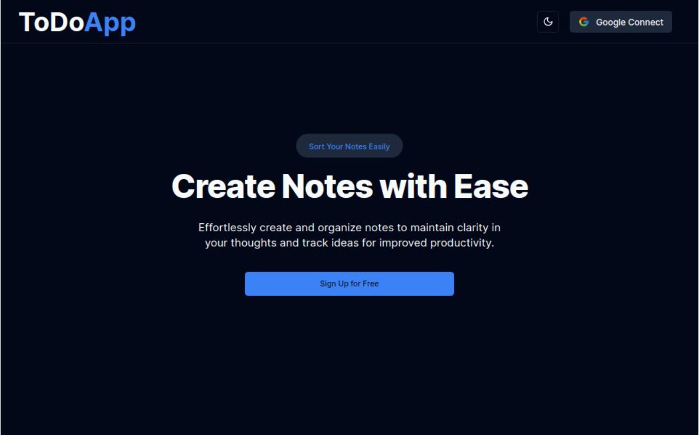

# Todo List Application

## Overview

This Todo List application is a frontend project built using Next.js, designed to help users manage their tasks efficiently. The application includes features such as task creation, updates, marking tasks as done, searching tasks, and displaying tasks in an expandable list format. Additionally, it includes authentication via Firebase and data storage using Supabase.

## System Design

### Features

- **Create Task**: Users can add new tasks.
- **Update Task**: Users can edit existing tasks.
- **Mark as Done**: Users can mark tasks as completed.
- **Delete Task**: Users can delete tasks.
- **Search Tasks**: Implemented search functionality to filter tasks using URL parameters.
- **Expandable List**: Tasks are displayed in an expandable list format, showing a description and a timestamp of the last update when expanded.
- **Skeleton Loading**: Skeleton screens are used to improve user experience during data loading.
- **Theme Change**: Users can switch between dark and light themes.
- **Fully Mobile Compatible**: The application is responsive and works well on mobile devices.

### Data Storage

- **Supabase**: Used as the backend for storing tasks.
- **Firebase**: Used for user authentication (login and signup).

### Framework

- **Next.js**: Utilized for building the frontend, with Server-Side Rendering (SSR) implemented for enhanced performance.

## Implementation

### Technologies Used

- **Next.js**: Framework for server-rendered React applications.
- **Supabase**: Backend service for storing task data.
- **Firebase**: Authentication service.
- **React**: Library for building user interfaces.
- **Tailwind CSS**: Utility-first CSS framework for styling.
- **Lucide Icons**: Icons for UI elements.

### Key Components

- **Task List**: Displays tasks in an expandable list format.
- **Task Form**: Form for creating and updating tasks.
- **Search**: Search bar to filter tasks, with search queries managed via URL parameters.
- **Authentication**: Login and signup forms using Firebase.
- **Theme Switcher**: Toggles between dark and light themes.
- **Skeleton Loader**: Displays loading skeletons while fetching data.

## Setup Instructions

### Prerequisites

- Node.js (>=14.x)
- npm (>=6.x) or yarn (>=1.22.x)

### Installation

1. **Clone the repository:**

   ```sh
   git clone https://github.com/your-username/todo-app.git
   cd todo-app
   ```

2. **Install dependencies:**

   ```sh
   npm install
   # or
   yarn install
   ```

3. **Configure environment variables:**
   Create a `.env.local` file in the root of the project and add the following environment variables:

   ```env
   NEXT_PUBLIC_SUPABASE_URL=your-supabase-url
   NEXT_PUBLIC_SUPABASE_ANON_KEY=your-supabase-anon-key
   NEXT_PUBLIC_FIREBASE_API_KEY=your-firebase-api-key
   NEXT_PUBLIC_FIREBASE_AUTH_DOMAIN=your-firebase-auth-domain
   NEXT_PUBLIC_FIREBASE_PROJECT_ID=your-firebase-project-id
   NEXT_PUBLIC_FIREBASE_STORAGE_BUCKET=your-firebase-storage-bucket
   NEXT_PUBLIC_FIREBASE_MESSAGING_SENDER_ID=your-firebase-messaging-sender-id
   NEXT_PUBLIC_FIREBASE_APP_ID=your-firebase-app-id
   ```

4. **Run the application:**

   ```sh
   npm run dev
   # or
   yarn dev
   ```

   Open [http://localhost:3000](http://localhost:3000) in your browser to see the application.

### Deployment

For deployment, follow the guidelines provided by Vercel (or any other hosting provider):

1. Push the repository to GitHub.
2. Import the repository to Vercel.
3. Configure the environment variables in the Vercel dashboard.
4. Deploy the application.

## Usage

1. **Sign up or log in** to access the todo list.
2. **Create new tasks** using the form.
3. **Update existing tasks** by clicking on the edit icon.
4. **Mark tasks as done** by checking the checkbox.
5. **Delete tasks** by clicking on the trash icon.
6. **Search for tasks** using the search bar.
7. **Expand tasks** to view the description and timestamp.
8. **Switch themes** using the theme toggle button.

## Bonus Points

- Implemented SSR for enhanced performance.
- Used URL parameters to manage search queries and filters.
- Applied good styling and alignment for a better user experience.
- Minimized database calls for faster response times.

## Screenshots



## Conclusion

This Todo List application is a robust and user-friendly tool for managing tasks, with features like task creation, updates, deletions, search, and theming. It leverages Next.js for server-side rendering, Supabase for backend storage, and Firebase for authentication, ensuring a seamless and efficient user experience.

## License

This project is licensed under the MIT License.
